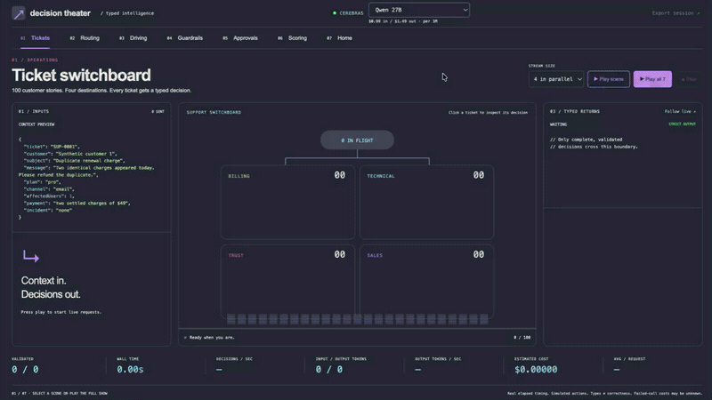

# typesafe-ai-mimic

Built while waiting for TypeSafe access. For fun and giggles. Because we can.

This is an independent TypeScript experiment that puts a strict judgment API in
front of an existing LLM. It borrows [TypeSafe.ai](https://typesafe.ai)'s
Choice / Score / Noul interface and adds an OpenAI-compatible endpoint so existing
LLM clients can use it too. It does not run TypeSafe's models.

[](docs/media/theater-demo.mp4)

[Watch or download the full demo (MP4)](docs/media/theater-demo.mp4) ·
[Static screenshot](docs/media/theater.png)

The animated preview shows the full recording at a reduced frame rate. The MP4
preserves the full 71-second demo at 720p / 30 fps and is ready to upload to X.

The Dracula-themed, single-screen player includes 100-ticket categorization, structured-map
navigation, ten seconds of WebGPU city driving, 100 guardrail checks, 100 agent
command approvals, 100 golden-reference evaluations, and home automation. Inputs stay on the left;
validated outputs stay on the right. Play one scene or run the whole slideshow.
Select Qwen 27B or GPT OSS 120B on Cerebras. The header shows input/output
pricing; requests, exports and cost estimates follow the selected model.
[Verification, measurements and limitations](docs/theater-verification.md).

## Monorepo and interactive demos

```text
packages/api/     Fastify proxy, strict contracts, tests, CLI examples and benchmarks
packages/demos/   Next.js + React app, demo catalog, pages and server-side handlers
docs/             API specification, research and verification summaries
```

One npm workspace lockfile; no separate installs inside packages.

```sh
npm ci
npm run dev       # Next.js at http://127.0.0.1:3001; fixtures, no paid inference
npm run dev:live  # real inference; uses provider keys in root .env
npm run dev:api   # standalone API at http://127.0.0.1:3000
```

**Decision Theater** supports single-stream or 2–5 concurrent bulk requests, automatic
scene advancement, real timing/token/cost metrics, and complete session exports.
The driving scene needs WebGPU on localhost or HTTPS. The current secure tailnet
URL is `https://josephs-macbook-pro.taila9c138.ts.net/`. The seven-scene reel includes
home automation, clickable request inspection and adjustable scoring validity.
The retired labs have been removed.

[How to add a demo](packages/demos/README.md#add-a-scene) ·
[Research and source notes](docs/showcase-research.md) ·
[API workspace](packages/api/README.md)

## What it does

- `POST /v1/systemone`: TypeSafe-style Choice, Score and Noul questions.
- `POST /v1/chat/completions`: normal OpenAI messages and strict `response_format.json_schema`.

Send context plus a contract. Cerebras produces compact numeric values and selection
indices; the proxy validates them and reconstructs declared labels and structure
locally. Invalid output fails closed. Provider reasoning and arbitrary generated
prose never become answer content. Unconstrained strings, streaming and tools are
rejected. See the [supported API](docs/context/api_reference.txt).

## Why Cerebras?

The theater uses Cerebras for its Qwen judgment calls. The current full-theater
measurement accepted **521 of 523 dispatched requests**, with **234 ms median
successful browser request latency**. It also encountered one provider rate limit
and one driving deadline cancellation. See the [scene-by-scene benchmark](docs/benchmarks/README.md)
for concurrency, quality, costs and limitations; this is not a provider comparison.

## The inefficient part

This is an inefficient stand-in for TypeSafe's purpose-built judgment service:
we ask a general-purpose LLM to *write* probabilities. Each TypeSafe question gets
its own call, repeating state and rubric input. A thirteen-question request means
thirteen provider calls, with only four running concurrently. That increases input
tokens, cost and queueing. The generic OpenAI schema path uses one call, but its
fields do not have the same isolation guarantee.

We have not run a head-to-head TypeSafe benchmark, so there is no measured slowdown
or cost multiplier to quote. Matching an API does not reproduce its underlying
model efficiency, calibration or quality. Our entropy-based confidence is a local
approximation. The point is an accessible experiment while on the waitlist, not a
claim of TypeSafe parity.

## Quick start

Requires **Node 22** and **npm 10**. From this checkout, try all seven examples
without credentials or paid inference:

```sh
npm ci
npm run examples
```

To start the real Cerebras-backed server:

```sh
# Create the file only if it does not already exist.
test -f .env || cp .env.example .env
```

Edit `.env`: set `CEREBRAS_API_KEY` and a **different** `PROXY_API_KEY` of at least
16 characters. Keep both private; clients use only the proxy key. Then:

```sh
npm run build
npm start
```

The server loads `.env` and listens at `http://127.0.0.1:3000`. In another terminal,
set `PROXY_API_KEY` to the same proxy key from `.env`, then make a judgment:

```sh
export PROXY_API_KEY='your-proxy-key-from-.env'
curl --fail-with-body http://127.0.0.1:3000/v1/systemone \
  -H "Authorization: Bearer $PROXY_API_KEY" \
  -H 'Content-Type: application/json' \
  -d '{
    "model": "jev-latest",
    "state": "Please refund the duplicate charge.",
    "questions": {
      "refund": {"type": "noul", "instructions": "Is money requested back?"}
    }
  }'
```

The response contains `answers.refund.noul` in `[0,1]`, actual token usage, and
`model: "qwen-3.8-27b"`. `jev-latest` is only a compatibility alias; it does not
select Jev. The probability is model-estimated, not guaranteed to be correct.

For an ordinary OpenAI-compatible request:

```sh
curl --fail-with-body http://127.0.0.1:3000/v1/chat/completions \
  -H "Authorization: Bearer $PROXY_API_KEY" \
  -H 'Content-Type: application/json' \
  -d '{
    "model": "qwen-3.8-27b",
    "messages": [{"role": "user", "content": "Please refund the duplicate charge."}],
    "response_format": {
      "type": "json_schema",
      "json_schema": {
        "name": "routing", "strict": true,
        "schema": {
          "type": "object",
          "properties": {"department": {"type": "string", "enum": ["billing", "technical", "other"]}},
          "required": ["department"], "additionalProperties": false
        }
      }
    }
  }'
```

`choices[0].message.content` contains JSON such as `{"department":"billing"}`.
For an OpenAI SDK client, set `baseURL: 'http://127.0.0.1:3000/v1'`, use the proxy
key, and supply a supported strict schema. Set `maxRetries: 0` when measuring
calls and cost. [Complete SDK example](docs/examples.md#ordinary-openai-sdk-call).

## Want a different inference backend?

Ask your coding agent to make the swap. This currently requires code changes;
changing an environment variable alone will not configure another provider.
Copy this prompt and replace the bracketed provider name:

> Replace Cerebras with [provider and model] as the inference backend. Read
> AGENTS.md and CONVENTIONS.md first. Trace packages/api/src/cerebras.ts and its callers in
> packages/api/src/evaluate.ts, then inspect model validation in packages/api/src/contracts.ts, startup
> configuration in packages/api/src/index.ts, and pricing in packages/api/src/metrics.ts. Verify the target
> provider's official structured-output support, tuple schemas, reasoning controls,
> usage fields and cancellation behavior. Adapt the compact numeric schema if
> necessary while preserving local type/range/length/distribution checks and both
> public HTTP contracts. Keep keys server-side, sanitize errors, and retain bounded
> bodies, queueing, deadlines, cancellation and zero automatic retries. Reject
> unsupported behavior explicitly. Update model IDs, .env.example, examples,
> benchmark preflight/pricing/timing extraction and documentation. Do not invent
> provider timings or infer parity from its OpenAI-compatible URL. Run the HTTP
> stub tests, npm run check and offline examples. Keep live verification separate,
> synthetic and within an explicit spend bound. Keep the change small; a provider
> plugin framework is unnecessary.

## Benchmark outcomes

Full theater, **2026-09-17 UTC**, Qwen 3.8 27B on Cerebras, production build.
All seven scenes were measured. The initial slideshow hit a rate limit during
Scoring; complete Scoring and Home runs followed separately at concurrency one.
Totals retain the interrupted work, so this was not one uninterrupted slideshow.

| Measurement | Outcome |
| --- | ---: |
| Validated / dispatched | 521 / 523 |
| Rate limits / deadline cancellations / automatic retries | 1 / 1 / 0 |
| Successful browser request latency p50 / p95 / p99 | 234 / 673 / 2,627 ms |
| Reported input / output tokens | 336,730 / 5,693 |
| Known estimated cost | $0.34184527 |
| Sum of measured scene durations, excluding gaps/transitions | 77.52 s |

Tickets, Guardrails and Approvals used concurrency five; routing, driving, the
complete Scoring run and Home were sequential. Quality remains separate: Tickets
matched 75/100 fixture outputs, Scoring 93/100, Home 24/24, and Guardrails and
Approvals 100/100 each. Driving had two collisions. Unknown usage for the failed
and canceled requests is excluded from cost. No provider decode speed was measured.
[Per-scene latency, method, raw exports and limitations](docs/benchmarks/README.md).

```sh
npm run benchmark      # local HTTP + upstream stub
npm run benchmark:live # real Cerebras; reads .env and overwrites the live report
npm run examples:live  # seven synthetic workflows against real Cerebras
```

Live commands enforce bounded calls and a conservative $1 list-price ceiling per
run. Examples use an ephemeral proxy credential and need only the Cerebras key.
No real devices or external functions are operated.

## Correct types are not correct judgments

Seven examples returned validated live outputs, but the smart-home scope and two
injection-screening judgments were wrong. Those results are preserved in the
[live report](docs/live-results.json). A type gate blocks arbitrary generated text;
it cannot prove semantic prompt-injection resistance or stop information from
being encoded in allowed numbers/selections. See [security boundaries](docs/security.md).
The current theater benchmark covers Qwen only; it does not compare models.

## Development and documentation

`npm run dev` starts the Next.js fixture app; `npm run dev:api` watches the API.
`npm run check` runs strict source/example type
checks, ESLint, both workspace test suites and both production builds.
Normal tests never use `.env` credentials.

- [Implementation plan and decisions](docs/plan.md)
- [Example source mapping and SDK usage](docs/examples.md)
- [Runner and benchmark commands](packages/api/examples/README.md)
- [HTTP API reference](docs/context/api_reference.txt)
- [Engineering conventions](CONVENTIONS.md)
